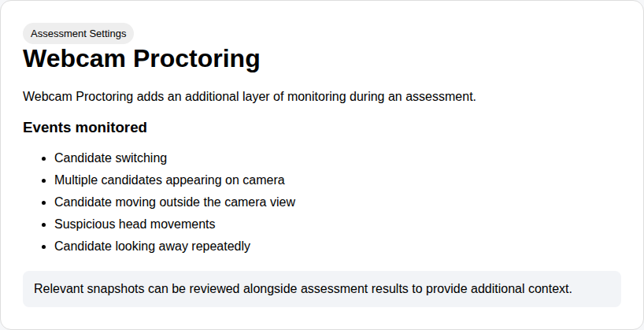

# Webcam Proctoring

Webcam Proctoring adds an additional layer of monitoring during an assessment.

## What it monitors

- Candidate switching
- Multiple candidates appearing on camera
- Candidate moving outside the camera view
- Suspicious head movements
- Candidate looking away repeatedly

Relevant snapshots can be reviewed alongside assessment results to provide additional context.

## Example

> This screenshot is generated automatically from the demo product page.
